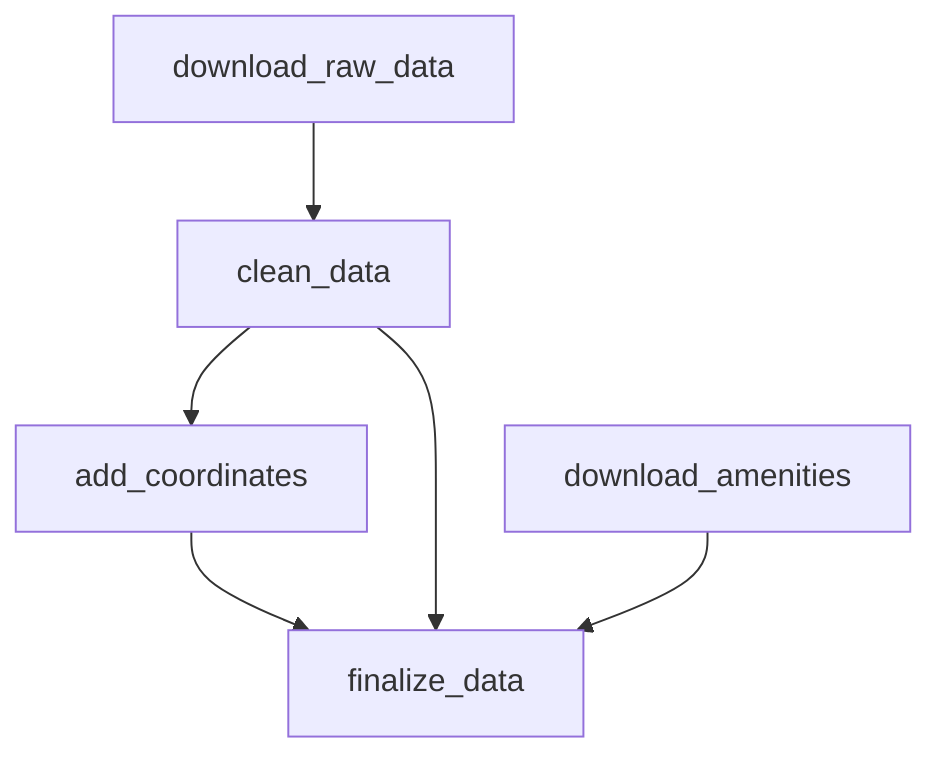

# ML-проект по прогнозу цены на недвижимость

## Архитектура системы

## Исследование

- Данные версионируются с помощью DVC
- Для каждого этапа обработки данных создан CLI-скрипт
- Эксперименты логируются с помощью MLFlow

Даг обработки данных

